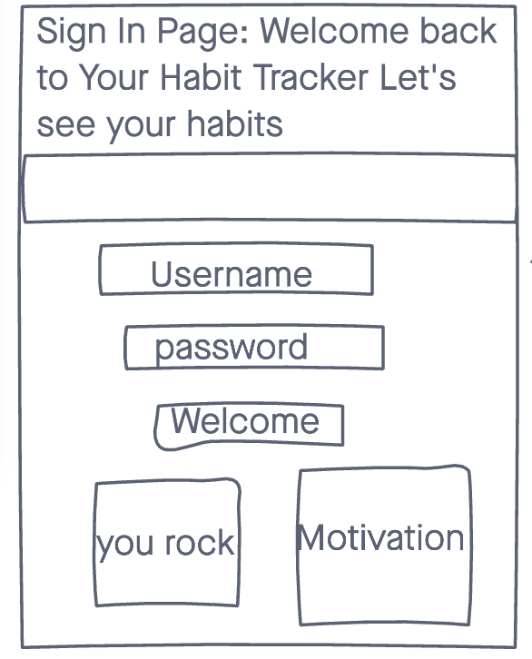

# Your Habit Tracker

### This is an app to track your weekly progress with habits you are trying to make!

## Screen Shots

- Here is the original ERD for this aplication

- Home Page Wireframe

- Sign In Wrieframe

- Sign Up Wireframe

## Technologies used:
- HTML 5
- CSS 3
- JavaScript
- jQuery 
- Mongo.db
- Mongoose
- Node
- Express
- Bcrypt
- Morgan
- Dotenv
- EJS
- Trello
- Heroku

## Getting Started
[Click Here](https://your-habit-tracker.herokuapp.com/) to see the application!

Here you can create an account or log in!
On your profile you can:
- Create a new habit
- Delete a habit
- track the days a week at a time

## Future Goals
- Have a navigation bar throughout
- see past weeks
